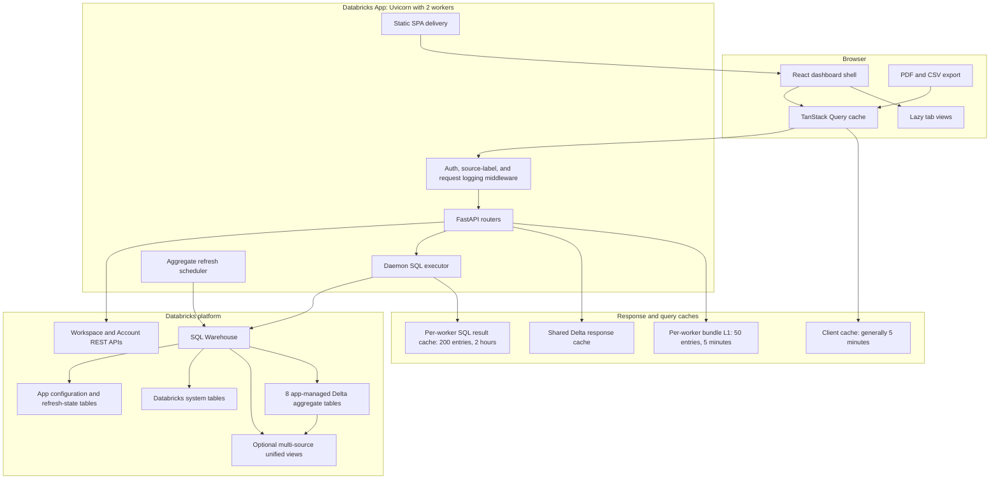
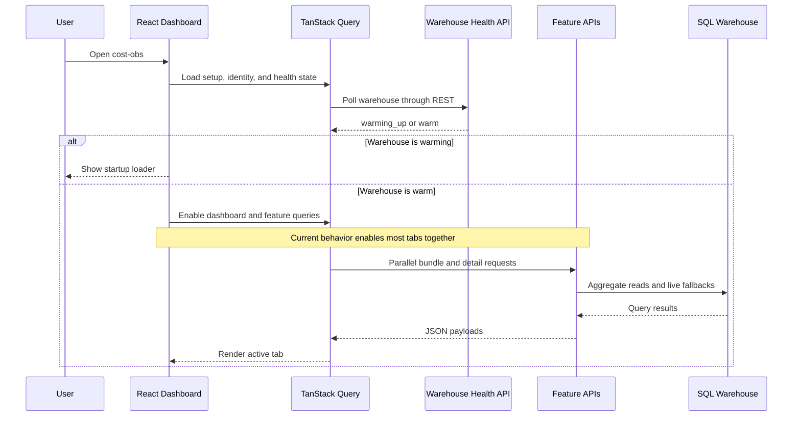
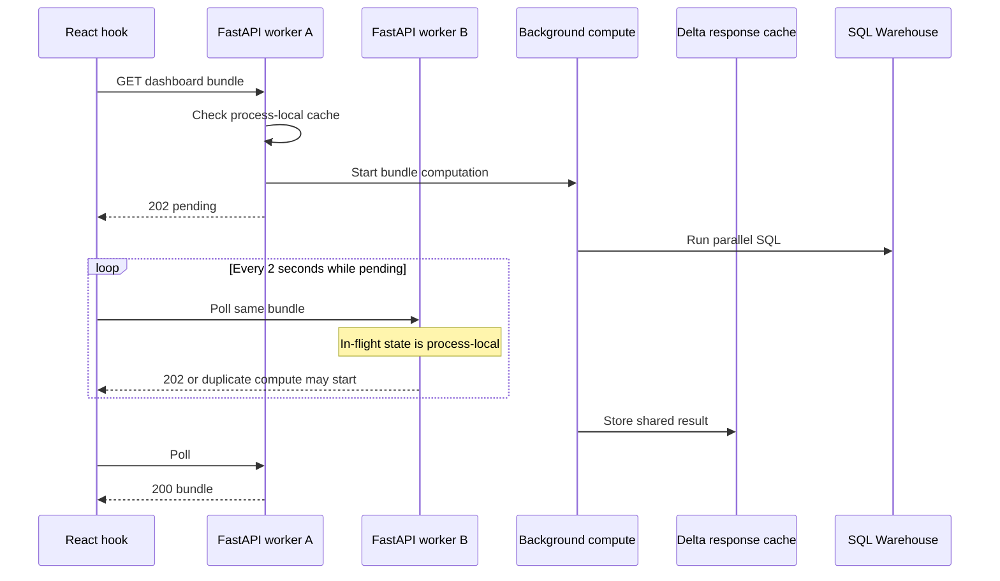
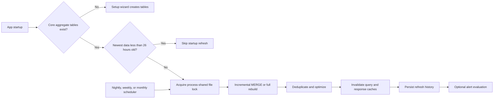
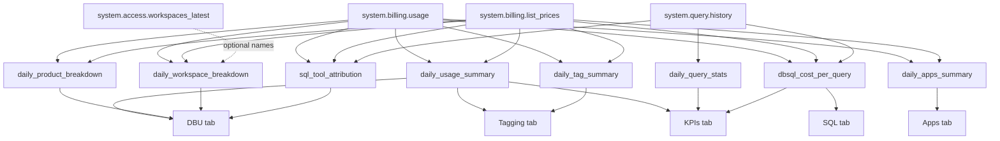
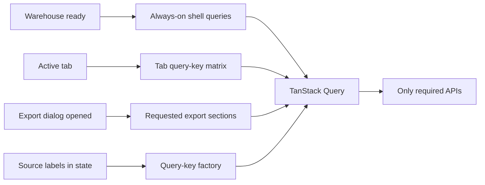

# Current Architecture and Performance Audit

**Application:** cost-obs v1.2  
**Audit date:** 2026-08-28  
**Scope:** React client, FastAPI service, Databricks SQL execution, caches, app-managed aggregate tables, refresh lifecycle, deployment, tests, and data lineage  
**Method:** Static source review plus production client build and automated test runs  
**Limitations:** No browser automation, production trace, warehouse query profile, or load test was run. Size measurements are from the local production build. Latency findings are architectural risks, not measured production percentiles.

This document supersedes the February 2026 `docs/PERFORMANCE_AUDIT.md` for current-state architecture and performance. Several major issues in that older audit have already been addressed, including bounded query caches, parallel bundle execution, app-managed aggregates, incremental refresh, restricted CORS, and tab module splitting.

## 1. Executive summary

cost-obs is a single-page React dashboard served by a two-worker FastAPI application inside Databricks Apps. Analytics requests pass through FastAPI routers to a Databricks SQL Warehouse. Eight app-managed Delta aggregate tables reduce repeated scans of Databricks system tables. Heavy DBSQL, Apps, and AI/ML bundles use a submit-and-poll pattern. The application also has process-local query caches and an intended cross-worker Delta response cache.

The architecture is production-minded, but four current bottlenecks dominate:

1. After the warehouse reports ready, the client enables almost every tab's data query at once, creating a burst of roughly 15 to 20 API requests before the user visits those tabs.
2. The shared Delta response cache is usually skipped by asynchronous request handlers on an L1 miss. With two Uvicorn workers and process-local in-flight sets, identical heavy work can run twice.
3. Parallel bundles open one SQL connection per query and do not have a shared concurrency budget, so simultaneous bundles can create connection and warehouse queue pressure.
4. PDF code is statically imported and module-preloaded. Recharts is also on the initial path because the default DBU tab needs charts. The initial JavaScript graph is therefore larger than the source-level lazy-loading structure suggests.

The highest-return sequence is:

1. Make Delta L2 reads asynchronous and coordinate in-flight work across workers.
2. Gate tab queries by the active tab and explicit export demand.
3. Bound SQL concurrency and evaluate connection reuse.
4. Dynamically import PDF generation.
5. Replace non-prunable date expressions and expand cache/concurrency tests.

## 2. System architecture

### Primary implementation boundaries

| Layer | Primary code | Responsibility |
|---|---|---|
| Bootstrap and shell | `client/src/main.tsx`, `client/src/App.tsx` | Setup gate, warehouse readiness, filters, tab state, query orchestration, exports |
| Shared client data | `client/src/hooks/useBillingData.ts` | API URL construction, React Query keys, stale times, submit-and-poll behavior |
| Feature views | `client/src/components/*`, `client/src/pages/*` | Charts, tables, filters, drilldowns, loading and empty states |
| HTTP service | `server/app.py` | Middleware, lifespan, workers, scheduler, router mounting, static delivery |
| SQL and caching | `server/db.py` | Authentication context, SQL connections, query cache, Delta response cache, parallel execution |
| Aggregate lifecycle | `server/materialized_views.py` | Create, incremental merge, deduplication, optimization, unified views |
| SQL templates | `server/queries/__init__.py` | Live system-table and fallback queries |
| APIs | `server/routers/*.py` | Bundles, feature endpoints, setup, settings, permissions, health |
| Deployment | `app.yaml`, `dba_deploy.sh` | Databricks App process and warehouse resource binding |

## 3. Request and query flow

### 3.1 Initial load

The warehouse health endpoint intentionally uses REST and does not run a synthetic SQL warm-up query. This avoids pinning serverless compute online, but a real first query can inherit the warehouse cold-start delay.

### 3.2 Heavy bundle submit-and-poll flow

DBSQL, Apps, and AI/ML use a non-blocking bundle protocol:

The design is sound, but the current shared-cache read path returns a miss when called on the event loop after an L1 miss. That weakens cross-worker coordination.

### 3.3 Refresh lifecycle

## 4. Data lineage: system tables to app aggregates to tabs

The code calls these relations materialized views, but the active implementation creates Delta tables with `CREATE OR REPLACE TABLE` and refreshes them with `MERGE`. In this document, "aggregate" refers to those app-managed Delta tables.

`{catalog}.{schema}` is the configured app storage target. If additional MV sources are configured, each aggregate can be read through a `{table_name}__unified` view.

### 4.1 Aggregate lineage matrix

| Databricks source | App-managed aggregate | Main APIs | Main tabs and components |
|---|---|---|---|
| `system.billing.usage`, `system.billing.list_prices` | `daily_usage_summary` | `/api/billing/dashboard-bundle-fast`, `/api/billing/kpis-bundle`, `/api/tagging/dashboard-bundle`, KPI trend APIs | DBU summary, Tagging summary, KPI trends, alerts |
| `system.billing.usage`, `system.billing.list_prices` | `daily_product_breakdown` | `/api/billing/dashboard-bundle-fast`, KPI trend APIs | DBU Spend Over Time, Spend by Product |
| `system.billing.usage`, `system.billing.list_prices`, optional `system.access.workspaces_latest` | `daily_workspace_breakdown` | `/api/billing/dashboard-bundle-fast`, workspace discovery, alerts | DBU Workspace Breakdown, account and workspace labels |
| `system.query.history`, `system.billing.usage`, `system.billing.list_prices` | `sql_tool_attribution` | fast billing bundle and SQL breakdown fallback path | DBU SQL attribution data and supporting SQL metrics |
| `system.query.history` | `daily_query_stats` | `/api/billing/kpis-bundle`, platform KPI trend APIs | Platform KPIs and Trends |
| `system.billing.usage`, `system.billing.list_prices`, `system.query.history` | `dbsql_cost_per_query` | `/api/dbsql/*`, `/api/billing/kpis-bundle` | SQL 360, top queries, query users, distinct-user KPIs |
| `system.billing.usage`, `system.billing.list_prices`, exploded `custom_tags` | `daily_tag_summary` | `/api/tagging/dashboard-bundle` | Spend by Tag, Spend by Key, tag statistics |
| `system.billing.usage`, `system.billing.list_prices`, rows with `billing_origin_product = 'APPS'` | `daily_apps_summary` | `/api/apps/dashboard-bundle` | Apps summary, app spend, app timeseries, SKU breakdown |

### 4.2 Aggregate dependency diagram

### 4.3 Direct system-table paths that bypass app aggregates

| System or external source | Direct consumers | UI destination |
|---|---|---|
| `system.billing.usage`, `system.billing.list_prices` | SKU, interactive compute, pipeline objects, infrastructure, AI/ML, users/groups, use cases, live fallbacks | DBU, Cloud, AI/ML, Users, Use Cases |
| `system.billing.account_prices` | Account price multiplier with list-price fallback | All spend displays |
| `system.query.history` | SQL details, warehouse health, stickiness and user KPIs, use-case object discovery | SQL, Optimize, KPIs, Use Cases |
| `system.compute.clusters` | Interactive cluster enrichment, infrastructure, AI/ML runtime clusters, tagging resources | DBU, Cloud, AI/ML, Tagging |
| `system.compute.warehouses` | Warehouse metadata and health | SQL, Optimize |
| `system.compute.warehouse_events` | Uptime, idle time, and rightsizing | SQL, Optimize |
| `system.lakeflow.jobs` | Job names and tagging enrichment | DBU Jobs and Pipelines, Tagging |
| `system.lakeflow.pipelines` | Pipeline names and tagging enrichment | DBU Jobs and Pipelines, Tagging |
| `system.lakeflow.job_run_timeline` | Job success and activity metrics | KPIs |
| `system.serving.served_entities` | Endpoint and model enrichment | AI/ML |
| `system.access.workspaces_latest` | Workspace names | Most tabs |
| `system.access.audit` | Readiness and permission probes | Setup and Settings |
| `system.dashboards.dashboards` | Optional object discovery | Use Cases |
| AWS CUR `actuals_gold` | AWS actual-cost router | Cloud Costs |
| Azure Cost Export `actuals_gold` | Azure actual-cost router | Cloud Costs |
| Configured GCP billing table | GCP actual-cost router | Cloud Costs |

### 4.4 End-to-end tab mapping

| Tab | Primary hook or request | Primary API | Preferred data path |
|---|---|---|---|
| DBU | `useDashboardBundleFast` | `/api/billing/dashboard-bundle-fast` | `daily_usage_summary`, `daily_product_breakdown`, `daily_workspace_breakdown`, live fallbacks |
| DBU details | `useSKUBreakdown`, `useInteractiveBreakdown`, `usePipelineObjects` | `/api/billing/sku-breakdown`, `/interactive-breakdown`, `/pipeline-objects` | Live billing plus compute and Lakeflow enrichment |
| SQL | `useDBSQLQueryCosts`, `useDBSQLTopQueries` | `/api/dbsql/*` | `dbsql_cost_per_query` plus live warehouse metadata |
| Optimize | Component `useQuery` calls | `/api/sql/warehouse-health`, `/idle-time` | Live warehouse events, warehouses, query history, billing |
| KPIs | `useKPIsBundle` | `/api/billing/kpis-bundle` | `daily_query_stats`, `dbsql_cost_per_query`, daily aggregates, selected live sources |
| AI/ML | `useAIMLDashboardBundle` | `/api/aiml/dashboard-bundle` | Live billing plus clusters and serving entities |
| Apps | `useAppsDashboardBundle` | `/api/apps/dashboard-bundle` | `daily_apps_summary` with live fallback |
| Tagging | `useTaggingDashboardBundle` | `/api/tagging/dashboard-bundle` | `daily_tag_summary`, `daily_usage_summary`, targeted live usage |
| Users | `useUsersGroupsBundle` | `/api/users-groups/bundle` | Live billing and Workspace SDK or SCIM metadata |
| Cloud Costs | `useInfraBundle`, cloud actual hooks | `/api/billing/infra-bundle`, `/api/*-actual/*` | Live billing/compute plus optional external gold tables |
| Use Cases | Page-local queries | `/api/use-cases/*` | App-owned use-case tables plus live billing and object discovery |

### 4.5 Lineage caveats

1. `dbsql_cost_per_query_prpr` has complete DDL but is not in the active create or refresh list and is not the mounted DBSQL API source.
2. Aggregate availability is considered core-ready when three core tables exist. Optional SQL, Apps, and Tagging aggregates can still be missing and take a fallback or unavailable path.
3. Multi-source unified views are created only when remote schemas match. Individual mismatches are skipped.
4. The Settings table-status list does not currently present all eight active aggregates.
5. `system.ai_gateway.usage` appears in experimental UI copy but has no active backend query lineage.
6. `system.lakeflow.job_runs` and `system.access.table_lineage` appear in documentation/footer copy but are not active dashboard sources.

## 5. Client architecture and performance

### 5.1 Strengths

- Warehouse readiness gates SQL-heavy requests and prevents cold-start contention with the health probe.
- Tab modules use `React.lazy`, Suspense, retry-on-chunk-failure, and per-tab error boundaries.
- Heavy bundles use React Query and submit-and-poll rather than holding an HTTP request indefinitely.
- Long dropdown lists use a shared virtualized list.
- The default DBU path reads a server-side fast bundle rather than assembling every card through independent browser requests.
- Settings prefetch waits for the main billing bundle.
- Expensive Optimize queries are correctly gated to the Optimize tab.
- Content-hashed static assets are cacheable while `index.html` is explicitly no-cache.

### 5.2 Current build baseline

Production build observed during this audit:

| Asset | Raw size | Gzip size | Initial-path implication |
|---|---:|---:|---|
| Main application bundle | about 528 KB | about 143 KB | Initial |
| Recharts vendor chunk | about 394 KB | about 115 KB | Module-preloaded because DBU charts are eager |
| PDF vendor chunk | about 618 KB | about 181 KB | Module-preloaded despite export-only use |
| TanStack Query vendor chunk | about 44 KB | about 14 KB | Initial |
| Date vendor chunk | about 23 KB | about 7 KB | Initial |
| Main CSS | about 70 KB | about 14 KB | Initial |
| Largest feature chunk, Cloud Costs | about 101 KB | about 18 KB | Lazy tab chunk |

The generated `vendor-react` chunk is effectively empty, which indicates the manual chunk split does not isolate React as intended.

### 5.3 Client findings

| Priority | Finding | Evidence | Consequence | Recommendation |
|---|---|---|---|---|
| P0 | Most feature queries enable together after warehouse readiness | `client/src/App.tsx` around lines 488 to 517 | Large initial API and SQL burst, unused polling, higher warehouse queue time | Gate by `activeTab`, tab visibility, and explicit export demand |
| P0 | PDF is statically imported | `client/src/App.tsx`, `client/src/utils/pdfExport.ts`, built `modulepreload` | Roughly 181 KB gzip downloaded before export | Dynamic-import PDF generation inside the export action |
| P1 | Source labels live in a module singleton and are absent from query keys | `client/src/hooks/useBillingData.ts` around lines 67 to 95 | Correctness depends on global invalidation; cache identity is implicit | Put source labels in React state/context and query-key factories |
| P1 | Global refresh invalidates every query | `client/src/App.tsx`, `TabRefreshButton.tsx` | Refreshing one tab can refetch inactive tabs | Invalidate only active-tab prefixes, with an explicit refresh-all action if needed |
| P1 | `App.tsx` owns too many concerns | Setup, readiness, queries, chrome, tabs, export, settings in one file | High change coupling and weak orchestration testability | Split into shell, query coordinator, export controller, and setup gate |
| P2 | Setup Wizard and Settings are eager imports | `client/src/App.tsx` | Main graph includes rarely used flows | Lazy-load after setup state or on dialog open |
| P2 | Multiple large feature files exceed 1,000 lines | SQL, Apps, Cloud, AI/ML, Use Cases | Harder testing and render isolation | Split by panel and colocate panel queries where appropriate |
| P2 | Pricing context value is not memoized | `client/src/context/PricingContext.tsx` | Avoidable consumer rerenders | Memoize callbacks and provider value |
| P2 | Stale-time policy differs between global defaults and hooks | `App.tsx` versus `useBillingData.ts` | Hard-to-predict freshness | Centralize client cache policy |
| P3 | Active tab is not URL-addressable | Local state in `App.tsx` | No deep links for support or sharing | Add a query parameter for the selected tab |

### 5.4 Recommended client query model

## 6. Backend architecture and performance

### 6.1 Strengths

- Eight app-managed aggregates reduce repeated raw system-table scans.
- Incremental `MERGE` refresh windows, deduplication, and periodic optimization reduce full rebuild frequency.
- Parallel bundle execution preserves request context across threads.
- Query results use a bounded TTL cache instead of an unbounded dictionary.
- Heavy bundles return 202 and poll.
- Startup does not issue synthetic warehouse warm-up traffic.
- A file lock prevents duplicate aggregate refreshes across the two workers.
- SQL work uses daemon threads so application shutdown is not blocked by long warehouse calls.
- Workspace identifiers are allowlisted before SQL interpolation.
- App storage validation blocks the legacy reserved default.
- Optional multi-source unified views support additive data sources and source-label filtering.

### 6.2 Backend findings

| Priority | Finding | Evidence | Consequence | Recommendation |
|---|---|---|---|---|
| P0 | Shared Delta cache reads are skipped on the async event loop after an L1 miss | `server/db.py` around lines 909 to 926; async router call sites | Cross-worker L2 reuse is much weaker than intended | Call `delta_cache_get` through `asyncio.to_thread`, or provide a native async cache API |
| P0 | Heavy-bundle in-flight sets are process-local | DBSQL, Apps, and AI/ML router modules; `app.yaml` uses two workers | Worker B can duplicate worker A's computation | Add shared lock/state, or at minimum recheck Delta L2 off-loop before compute |
| P0 | SQL concurrency is not globally bounded | `execute_queries_parallel`, bundle fan-out, 20-thread executor | Connection storms and warehouse queueing under concurrent users | Add a process and ideally cross-worker concurrency budget |
| P0 | Each query opens and closes a SQL connection | `server/db.py` connection and execute paths | Repeated auth/TLS/session overhead | Evaluate safe read-only connection pooling with health checks |
| P1 | Date wrapping can prevent partition pruning | `DATE(start_time)` in aggregate SQL and live templates | Large `system.query.history` scans | Use half-open timestamp range predicates |
| P1 | Tagging bundle remains synchronous | `server/routers/tagging.py` | Long request under large accounts | Adopt the established 202/poll bundle pattern |
| P1 | Legacy full dashboard bundle remains live-table heavy | `server/routers/billing.py` | Accidental use can trigger many raw scans | Remove, deprecate, or wire it to aggregate fast paths |
| P1 | Some errors return HTTP 200 with empty or zero-like payloads | Multiple routers | Failures can look like true zero spend | Standardize `available:false` and typed error responses |
| P1 | Aggregate refresh can run eight SQL operations concurrently | `server/materialized_views.py` | Refresh competes with user traffic | Give refresh a configurable, lower concurrency limit |
| P2 | Cache invalidation and L1 state are process-local | Two Uvicorn workers | Workers can temporarily disagree after refresh | Broadcast invalidation through shared state or reduce reliance on L1 |
| P2 | Durable state spans local files, DBFS, and Delta | `server/db.py`, Settings, startup | More recovery branches and race windows | Consolidate app-owned durable configuration |
| P2 | Optional Jobs refresh template can overlap the in-app scheduler | Jobs template plus `server/app.py` scheduler | Duplicate rebuild ownership | Document and enforce one refresh owner |

### 6.3 Cache architecture

| Cache | Size and TTL | Scope | Current assessment |
|---|---|---|---|
| TanStack Query | Commonly 5 minutes; global default 30 minutes | Browser | Useful, but policy is inconsistent |
| SQL query TTLCache | 200 entries, 2 hours | FastAPI worker | Bounded and effective for repeated SQL in one worker |
| Delta bundle L1 | 50 entries, 5 minutes | FastAPI worker | Fast but process-local |
| Delta response table | Endpoint-specific, commonly 5 to 30 minutes | Shared through SQL | Correct design; async read integration is incomplete |
| MV availability caches | Usually minutes | FastAPI worker | Reduces metadata probes; negative caches can temporarily force live fallback |
| Metadata caches | 5 minutes to 1 hour | FastAPI worker | Appropriate for names, grants, and resource metadata |

## 7. Aggregate refresh design

The refresh manager creates or incrementally merges:

1. `daily_usage_summary`
2. `daily_product_breakdown`
3. `daily_workspace_breakdown`
4. `sql_tool_attribution`
5. `daily_query_stats`
6. `dbsql_cost_per_query`
7. `daily_tag_summary`
8. `daily_apps_summary`

Typical reprocessing windows are 14 days for billing aggregates, 7 days for SQL attribution and query stats, and 5 days plus overlap for cost-per-query. A lookback-setting change promotes the next refresh to a full rebuild.

Important operational properties:

- Startup only refreshes when core tables already exist and data is older than 26 hours.
- Initial creation belongs to the Setup Wizard.
- DDL runs as the service principal.
- A `/tmp` file lock coordinates refreshes among workers in one app container.
- Refresh completion clears caches and persists history.
- Multi-source views are rebuilt when additional aggregate sources are configured.

## 8. Deployment and runtime

| Property | Current state |
|---|---|
| Runtime | FastAPI on Uvicorn |
| Worker count | 2 |
| Graceful shutdown | 10 seconds |
| SQL resource | Databricks App SQL Warehouse resource |
| Recommended warehouse configuration in code | Large, 1 to 2 clusters, 10-minute auto-stop |
| Frontend delivery | FastAPI static files with immutable hashed assets |
| Index caching | Explicitly disabled |
| Deployment approach | Databricks Apps plus deployment script; not a Databricks Asset Bundle |
| Scheduled refresh | In-application scheduler, with optional external Jobs template |

## 9. Reliability, correctness, and operational observations

1. Service-principal-only SQL identity is predictable and avoids mixed-identity cache keys in the active configuration.
2. Source labels are propagated through a request ContextVar and included in backend bundle cache keys.
3. Workspace filters use an allowlist before SQL construction.
4. Aggregate and configuration restoration across redeploys is thoughtful, but the number of persistence locations increases complexity.
5. Error handling is not uniform. `server/errors.py` exists, but several routers still use ad hoc payloads.
6. Debug endpoints should remain reviewed for production-safe response content.
7. The first real query after auto-stop can be slow by design. UI loading states should continue to distinguish warehouse warming from application errors.

## 10. Test coverage assessment

### Current strengths

- Client tests protect SQL first-load behavior, KPI unavailable states, Settings permissions, readiness, debugger, and destructive Settings behavior.
- Server tests cover setup readiness, permissions bundles, and feature gating.
- Multiple manual integration scripts exercise parallelism, MV consolidation, workspace filtering, and cross-fix behavior.

### Material gaps

- No automated test for Delta cache reads from an async handler.
- No cross-worker in-flight or cache-coordination test.
- No global SQL concurrency-budget test.
- No aggregate MERGE and deduplication fixture suite.
- No query-key test proving source labels are part of client cache identity.
- No active-tab enabled-matrix test.
- No export lazy-load or export-data completeness test.
- No automated visual dark-mode regression test. Browser automation is intentionally disabled in this workspace, so a human screenshot checklist is still required.

## 11. Prioritized implementation roadmap

### Phase 1: Runtime load and cache correctness

1. Move every Delta L2 read off the event loop.
2. Recheck shared cache before starting background bundle work.
3. Add shared in-flight coordination.
4. Introduce a configurable SQL concurrency semaphore.
5. Add tests for all four behaviors.

### Phase 2: Client demand-driven fetching

1. Define a tab-to-query dependency matrix.
2. Enable only the active tab's queries plus shell essentials.
3. Let Export request missing sections on demand.
4. Put source labels into query keys.
5. Scope manual and automatic refreshes.

### Phase 3: Initial payload

1. Dynamic-import PDF generation.
2. Lazy-load Setup Wizard and Settings.
3. Decide whether Recharts is an accepted default-tab dependency or split the DBU charts.
4. Correct or remove the empty React vendor chunk.
5. Compress the large Azure logo asset.

### Phase 4: SQL efficiency

1. Replace `DATE(timestamp_column)` predicates with half-open ranges.
2. Profile the eight aggregate refresh statements in Query History.
3. Lower refresh concurrency.
4. Move Tagging to 202/poll.
5. Retire the legacy live dashboard bundle.

### Phase 5: Maintainability and observability

1. Split `App.tsx` and the largest feature views.
2. Standardize router error contracts.
3. Consolidate durable configuration.
4. Add request-level metrics for cache hit layer, SQL queue time, query count, and bundle duration.
5. Add benchmark budgets to release checks.

## 12. Recommended performance measurements

The following measurements are needed before assigning numeric improvement targets:

| Measurement | Method | Target question |
|---|---|---|
| Initial request fan-out | Browser network capture or server access logs | How many APIs and SQL statements run before first DBU paint? |
| Bundle latency | Request logs plus Query History | Which bundle dominates p50 and p95? |
| Cache layer hit rates | Add L1/L2/miss counters | Is Delta L2 reducing cross-worker work? |
| Duplicate compute rate | Log bundle key and worker ID | How often do both workers compute the same key? |
| SQL connection setup time | Timed connection instrumentation | Is pooling worth the operational complexity? |
| Warehouse queued time | Query History | Is concurrency above useful warehouse parallelism? |
| Aggregate refresh duration | Existing per-table timing log | Which aggregate sets the rebuild critical path? |
| First-load JS transfer and parse | Browser performance trace | How much does dynamic PDF loading save? |
| Tab interaction latency | User timing marks | Does tab-gated fetch remain responsive? |

## 13. Architecture decision recommendations

### ADR 1: Demand-driven tab data

Adopt active-tab query gating. Keep only identity, setup, warehouse status, workspace filters, pricing mode, and the default landing bundle always eligible. Treat report export as a separate data consumer that requests missing sections explicitly.

### ADR 2: Shared bundle coordination

Keep two web workers only if heavy-bundle state is coordinated across workers. A Delta lock row, a small shared lock table, or another shared coordinator is preferable to process-local sets. If coordination is not implemented, measure whether one worker with bounded SQL threads is more predictable.

### ADR 3: Cache ownership

Make the Delta response table the authoritative cross-worker bundle cache. Process-local caches should be accelerators only. Every asynchronous handler must read L2 without blocking the event loop.

### ADR 4: Aggregate nomenclature

Document that the current "MV" layer is app-managed Delta aggregate tables plus optional unified views. Reserve "materialized view" for a future native Databricks materialized-view implementation if one is adopted.

## 14. Overall verdict

The current application has a strong functional architecture and several mature operational safeguards. Its largest performance problems are not missing optimizations; they are mismatches between intended boundaries and runtime behavior:

- lazy tabs but eager tab data,
- a shared cache that async handlers usually do not read,
- two workers but process-local in-flight coordination,
- parallel bundles without a global SQL budget,
- an export-only PDF subsystem on the initial module graph.

Resolving those boundary mismatches should improve predictability, reduce SQL Warehouse contention, and simplify future optimization more than isolated query or component micro-tuning.
